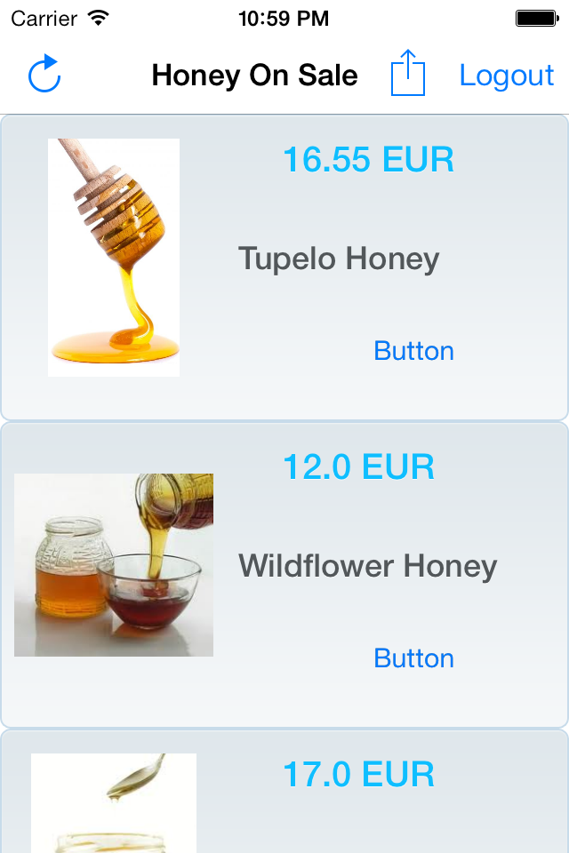
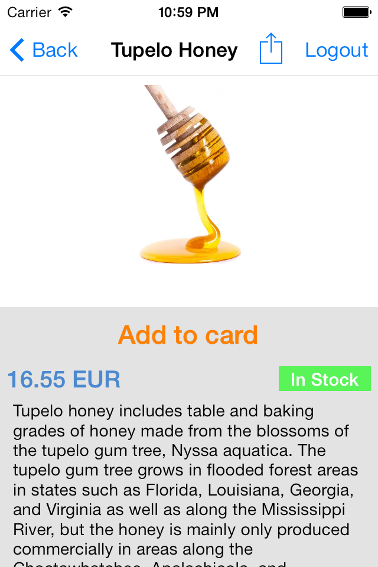
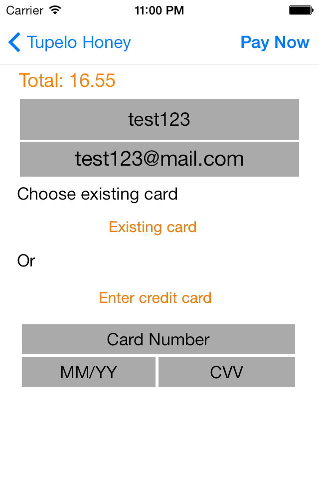
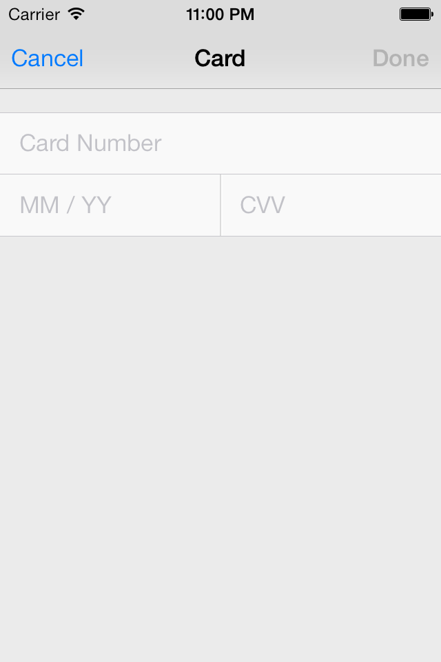
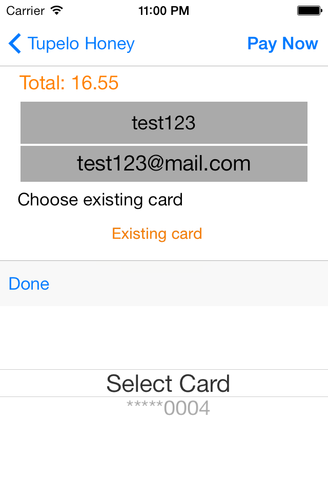

# Recurrent Billing with PAYMILL

PAYMILL is a full-stack payment solution with very reasonable pricing and is easy to setup. See how to add it to a iOS application here, for back end we use [Parse](https://parse.com). If you want to use it only in iOS application you can look at VoucherMill(https://github.com/paymill/paymill-ios/tree/master/samples/vouchermill)

If you ever need to process credit card payments or recurring payments aka. subscriptions through your iOS applications, you should take a look at PAYMILL. PAYMILL is a payment gateway that is easy to set up and which is very developer friendly. It only charges fees on a per-transaction basis.


### What does the application

The application, which we are going use is a simple store that sells jars of honey ;) The customer can browse the available jars and add each of them to his shopping basket. When the user is done with his selection, he can checkout the order by providing a credit card manually or by scanning it.

When the user enter his credit card we use PAYMILL's [iOS SDK](https://github.com/paymill/paymill-ios) to get a token from PAYMILL. This token will be send to our backend and a transaction created from it with help of PAYMILL's [JavaScript SDK](https://github.com/paymill/paymill-js). For easy scan of credit card we use [card.io](https://www.card.io).

Before you use the app you must register as merchant in PAYMILL's website and get your public and private key. Private key you must set on the backend or in our case in Parse, the public key must be used in iOS part.

First thing you need to do is to login or register in HoneyStore Application.


There are four different products that user can choose from.


When the user select on one of the products, he will be redirected to the details page, there he can read more about his choice and to add it to the shopping cart.


On the checkout page the user have to provide a credit card, if none exists.


He can scan it, or he can enter the requested information manually.


If the user has already given his credit card, he just need to select it.


### Application internals

**Dependencies management**
Lets start at the beginning.
As every application developer you don't want to write everything on your own.
Nowadays for each programming language there are a lot of tools and frameworks, which we can use to speed up the development process and make our lives easier.

For dependancies management *Honey Store* uses very popular dependency manager: **CocoaPods**:
* [CardIo](https://github.com/card-io/card.io-iOS-SDK) - for easy scanning credit card.
* [PARSE](https://parse.com/) - we use PARSE as backend
* [paymill](https://github.com/paymill/paymill-ios) - iOs library, which simplifies development against PAYMILL API and hides communication infrastructure.

Before you start you must install **CocoaPods**, please read you to install it on http://cocoapods.org/.

After successful installation locate  *Honey Store* pod file and run in your terminal:
```objective-c
  pod install
```

As you can see **CocoaPods** prepare your project file and download all dependency SDK. After everything is complete you are ready to go. Open xcworkspace file and you will see the main project *Honey on Sale* .

**Project Structure**

The application is virtually separated in tree parts: User management, Business Logic, Screens, Resources and Database.

User management

For users management we use PARSE SDK. When you lunch the application you will see PARSE's SignUp and Login screen. After the user register himself in the application, credentials are send to PARSE and then we use PAYMILL's JS SDK to create client Id. By this Id we make all transaction to PAYMILL.

For easy and fast implementation we use that functionality from PARSE iOS SDK. There are ready to use Login, SingUp controllers and views, this save us hours of coding.

Business Logic

In iOS part our Business Logic is represented by PMLProduct and PMLStoreController. Products are items that we sell on our store, when application run we download them from PARSE and then show them in our store. We use StoreController to store all data that we need in our store like purchases and available products.

There is another part of Business Logic, which is implement in our backend(PARSE) code. You can find this code in '.\Parse\main.js', here we have methods for client info, register our user in PAYMILL and create transactions.

Screens

All screen that user see are implemented in iOS project.

Resources

For iOS we have images, icons, storyboard and plist file, for backend we need PAYMILL's library for PARSE i.e 'paymill.parse.js'.

**Database**

Because our database is located in PARSE cloud, you must have valid user and password for it. After the registration you must create application for example 'HoneyStore' and get application keys. Please find the [installation of PARSE Cloud](https://parse.com/docs/cloud_code_guide)

After the installation please find your application keys at *[Application Name]->Settings->Application Keys*. Then copy productDB.js, main.js, paymill.parse.js in your *cloud* directory and run in console

```dos
    curl -X POST \
      -H "X-Parse-Application-Id: APPLICATION_ID" \
      -H "X-Parse-REST-API-Key: APPLICATION_REST_API_KEY" \
      -H "Content-Type: application/json" \
      --data-binary @productDB.json \
      https://api.parse.com/1/batch
```
This will create your database. After that open main.js and fill your private PAYMILL key, then run:

```dos
   parse deploy
```
This will upload all code that you need for the backend.

**Models**

In our app we have 2 different Models

* User: for user management we have PARSE's PFUser, by this class we can take current user and all info about him. In our app users are extended with one more property 'paymillClientId'.
* Product: contains information from PARSE server. All products are stored in our database.

User management is very boring issue, we can escape from this by using PARSE functionality. It is very easy to use and will save us a lot of time. Here is very simple way to use it.
When application start we check if there is current user:

```objective-c
  if (![PFUser currentUser])
```
If there is no active user we use PARSE *PFLogInViewController* for login screen (on this screen there is also functionality to SignUp). When user create an account it automatically calls backend and save the new user in our database.
But before save, we call PAYMILL go get client Id. We need this *client Id* when we create transactions and payments, that's why we save it with the user.

```javascript
Parse.Cloud.beforeSave("_User", function(request, response) {
  paymill.clients.create(request.object.email, request.object.username).then(function(result) {
     request.object.set("paymillClientId", result.id);
     response.success();
  }, function(e) {
    response.error("save user failed" + e);
  });
});
```

In your database we have 4 hardcoded products, to show them in our store we make a request to PARSE. When the user login we make following call in *PMLStoreController*. By this code we pull all Products from database and save them as PMLProduct in memory

```objective-c
- (void)getProductsWithComplte:(ControllerCompleteBlock)complete{

  PFQuery *query = [PFQuery queryWithClassName:@"Product"];
    if(self.products == Nil){
        self.products = [[NSMutableArray alloc] init];
    }
    [self.products removeAllObjects];

  [query findObjectsInBackgroundWithBlock:^(NSArray *objects, NSError *error) {
    for (PFObject *obj in objects) {
            PMLProduct* product = [PMLProduct parse:obj];
            [self.products addObject:product];
        }
        complete(error);
  }];
}
```

**Store Controller**

* StoreController: contains information about our store, here we contains orders, products and total amount.
To save all products and purchases we use PMLStoreController, this is logical prepresentation of our store. For example wen user add product to his card we save it in our controller. When user go to payment screen we calculate the amount of all orders and put it in the payment. When we want to pull products from database we call:

```objective-c
- (void)getProductsWithComplte:(ControllerCompleteBlock)complete
```

**View Controllers**

Our iOS application has 5 view controllers

* PMLDefaultViewController: This is main controller of our application, on this controller we decide if there is active user, or ask user to SingIn.
* PMLCheckoutViewController: This is base class for view controllers where have cart button, for example PMLProductDetailsViewController and PMLStoreViewController .
* PMLStoreViewController: in this view controller we are dealing with products that user can buy, this is the front screen of our store. It present simple table controller with predefined cells.
For better view we predefine every cell and implement them in PMLProductTableViewCell.
* PMLProductDetailsViewController: On this view we show detailed information for selected product, here we have 'add to card' button, so user can add this product in his cart.
* PMLPaymentViewController: This controller is care for our payments and orders, on it we make actual checkout.


**Handling the credit cards**

 Once the user selects his orders, he goes to *PMLPaymentViewController*. And here we use another very useful library: CardIo.
 Using CardIo you avoid the boring impltementation of all controls that are needed for entering credit card info. Before use it you must register in CardIo wesite and get CardIoToken.
 After that put your TOKEN in

```objective-c
 #define CARDIO_TOKEN @"CARD_IO_TOKEN"
```
To receive credit card info our controller must inplement *CardIOPaymentViewControllerDelegate* @protocol.
After all the data is entered we procced to sent the data to PAYMILL and get payment token.

```objective-c
- (void)createTransactionForAccHolder:(NSString *)ccHolder cardNumber:(NSString*)cardNumber
                          expiryMonth:(NSString*)expiryMonth
                           expiryYear:(NSString*)expiryYear cardCvv:(NSString*)cardCvv{
    PMError *error;
    PMPaymentParams *params;
    // 1. generate paymill payment method
    id paymentMethod = [PMFactory genCardPaymentWithAccHolder:ccHolder
                                                   cardNumber:cardNumber
                                                  expiryMonth:expiryMonth
                                                   expiryYear:expiryYear
                                                 verification:cardCvv
                                                        error:&error];
    if(!error) {
        // 2. generate params
        params = [PMFactory genPaymentParamsWithCurrency:self.currency amount:[self.amount intValue]
                                             description:self.description error:&error];
    }

    if(!error) {
        // 3. generate token
        [PMManager generateTokenWithPublicKey:PAYMILL_PUBLIC_KEY
                                     testMode:YES method:paymentMethod
                                   parameters:params success:^(NSString *token) {
                                       //token successfully created
                                       [self createTransactionWithToken:token];
                                   }
                                      failure:^(PMError *error) {
                                          //token generation failed
                                          NSLog(@"Generate Token Error %@", error.message);
                                          [MBProgressHUD hideAllHUDsForView:self.view animated:YES];
                                      }];
    }
    else{
        [MBProgressHUD hideAllHUDsForView:self.view animated:YES];
        NSLog(@"GenCardPayment Error %@", error.message);
    }
}
```

First we generate payment with client's info, after that we add amount and description to your payment. On next step we  get the encoded representation of the credit card as token.
This token is valid for 5 minutes and can be used only one time. Then we call *createTransactionWithToken* on our backend to create the transaction.

```objective-c
- (void)createTransactionWithToken:(NSString*)token {

    NSMutableDictionary *parameters = [[NSMutableDictionary alloc] init];
    [parameters setObject:token forKey:@"token"];
    [parameters setObject:self.amount forKey:@"amount"];
    [parameters setObject:self.currency forKey:@"currency"];
    [parameters setObject:self.description forKey:@"descrition"];

    [PFCloud callFunctionInBackground:@"createTransactionWithToken" withParameters:parameters
                                block:^(id object, NSError *error) {
                                    if(error == nil){
                                        [self transactionSucceed];
                                    }
                                    else {
                                        [self transactionFailWithError:error];
                                    }
                                    [MBProgressHUD hideAllHUDsForView:self.view animated:YES];
                                } ];

}
```

**Dealing with old credit cards**

When user made one payment, PAYMILL saves this payment as unique ID. With this id we can make another payment, this means that if user enters his credit card info we can he can use it again without entering card info.
On our backend we have method to get all previous payments:

```javascript
Parse.Cloud.define("getPayments", function(request, response) {
  Parse.Cloud.useMasterKey();
  var clientId = Parse.User.current().get("paymillClientId");
  paymill.clients.detail(clientId).then(function(client) {
    var result = [];
    for (var i = 0; i < client.payment.length; i++) {
      result.push(client.payment[i]);
    }
    response.success(result);
  }, function(error) {
    response.error("couldnt list payments:" + error);
  });
});
```
To call this method we implement method(*getOldPayments*) to get all previous payments when *PMLPaymentViewController* appear.
When the user selects one of these payments, we only need to send the payment Id to PAYMILL and amount to create  the transaction.

```objective-c
- (void)createTransactionWithPayment:(NSString*)paymentId
{
    NSMutableDictionary *parameters = [[NSMutableDictionary alloc] init];
    [parameters setObject:paymentId forKey:@"paymillPaymentId"];
    [parameters setObject:self.amount forKey:@"amount"];
    [parameters setObject:self.currency forKey:@"currency"];
    [parameters setObject:self.description forKey:@"descrition"];
    [PFCloud callFunctionInBackground:@"createTransactionWithPayment" withParameters:parameters
                                block:^(id object, NSError *error) {

                                    if(error == nil){
                                        [self transactionSucceed];
                                     }
                                    else {
                                        [self transactionFailWithError:error];
                                    }
                                    [MBProgressHUD hideAllHUDsForView:self.view animated:YES];
                                } ];

}
```

**Adding PAYMILL’s API Key**

To use PAYMILL in our application we need to register as merchant in PAYMILL's website. Put your Public Key in the iOS application.

```objective-c
  NSString *PAYMILL_PUBLIC_KEY = @"PAYMILL_PUBLIC_KEY";
```

and your Private Key in backend
```javascript
  paymill.initialize("PAYMILL_PRIVATE_KEY");
```


